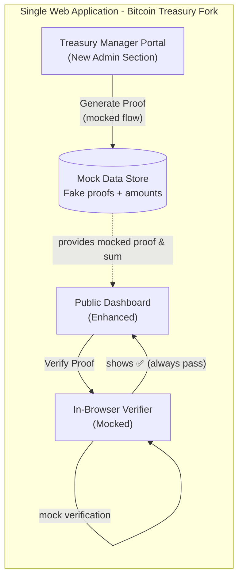
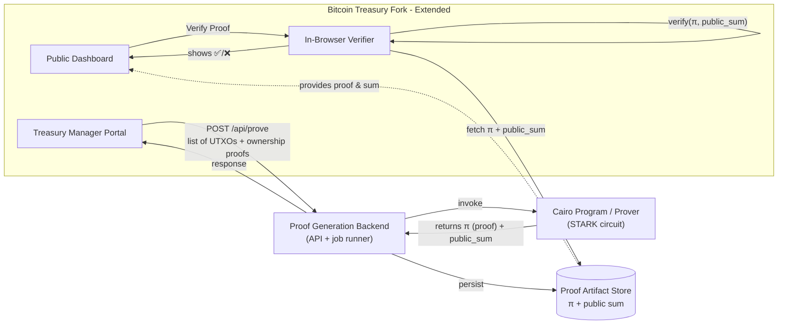

# Product Requirements Document (PRD)

**Project Name:** zkpoor (Zero Knowledge Proof Of Outstanding Reserves)

## 1. Overview

### 1.1. Problem Statement

Today, companies like MicroStrategy claim to own large amounts of BTC but refuse to publish addresses due to *security concerns*. Current "proof of reserves" disclosures rely on voluntary claims without cryptographic verification.

### 1.2. Goal

zkpoor enables companies to **prove their BTC holdings cryptographically, without revealing addresses or UTXOs**, by leveraging **STARK proofs**.

This demonstrates a practical solution to the "security vs. transparency" dilemma and strengthens Bitcoin's culture of verifiable trust.

### 1.3. Hackathon Deliverables

**Single Web Application (fork of Bitcoin Treasury)**

The main deliverable is a unified web application that extends the existing [Bitcoin Treasury](https://github.com/block/bitcoin-treasury) repository with new functionality:

1. **Enhanced Public Dashboard**
   * Original Bitcoin Treasury features (displaying public BTC holdings)
   * Added **"Verify with STARK"** button for cryptographic verification
   * In-browser proof verification with clear UI feedback

2. **Integrated Treasury Manager Interface**
   * New protected section for treasury managers
   * UI for inputting UTXO lists and generating proofs
   * Seamless integration within the same application

3. **Development Phases**
   * **Phase 1 (Initial Focus):** UI/UX implementation with mocked proof generation and verification
   * **Phase 2:** Backend integration with actual STARK proof generation
   * **Phase 3:** Cairo program implementation for cryptographic proofs

---

## 2. Application Architecture & Components

### 2.1. Unified Web Application (Bitcoin Treasury Fork)

**Base Repository:** Fork of [Bitcoin Treasury](https://github.com/block/bitcoin-treasury)

**Extended Features:**

* **Public Dashboard (Enhanced)**
  * Original Bitcoin Treasury functionality for displaying BTC holdings
  * New **"Verify Proof"** section with cryptographic verification UI
  * Real-time verification results with clear success/failure indicators
  * Responsive design maintaining the original treasury aesthetic

* **Treasury Manager Portal (New)**
  * Protected admin interface accessible via authentication
  * UTXO input form with validation and user-friendly error handling
  * Proof generation workflow with progress indicators
  * Results dashboard showing generated proofs and their status

* **Technical Stack:**
  * Built on existing Bitcoin Treasury foundation (likely Next.js/React)
  * Extended with new React components and pages
  * Client-side JavaScript for proof verification
  * Mock API integration (Phase 1) → Real backend (Phase 2+)

### 2.2. Backend Services (Future Phases)

* **Proof Generation API**
  * RESTful endpoints for proof generation requests
  * UTXO validation and processing
  * Integration with Cairo proof generation system

* **Cairo Proof System**
  * STARK circuit implementation for BTC reserve verification
  * Zero-knowledge proof generation without revealing individual UTXOs
  * Cryptographic validation of UTXO ownership

---

## 3. User Stories

### Phase 1 (UI/UX Focus with Mocked Data)
* **As a treasury manager,** I want an intuitive interface to input my UTXO data and generate proofs, so that I can easily prove reserves without technical complexity.
* **As a public user,** I want to verify proofs directly in the browser with clear visual feedback, so that I can trust the verification process.
* **As a developer,** I want to see the complete UI/UX flow working with mocked data, so that I can validate the user experience before implementing complex cryptography.

### Future Phases
* **As a company treasury manager,** I want to prove my BTC reserves without disclosing addresses, so that I can demonstrate solvency without increasing attack risk.
* **As an investor or public observer,** I want to verify a company's BTC holdings cryptographically in the browser, so that I don't have to blindly trust voluntary disclosures.
  
## Architecture (Unified Application)

### Phase 1: UI/UX with Mocked Data

### Future Architecture: Full Implementation

## 4. Implementation Plan

### Phase 1: UI/UX Foundation (Current Focus)
**Goal:** Create a fully functional user interface with mocked proof generation and verification

**Key Deliverables:**
1. **Fork Setup**
   * Fork the Bitcoin Treasury repository
   * Set up development environment
   * Understand existing codebase structure

2. **Enhanced Public Dashboard**
   * Add "Verify Proof" button to existing treasury display
   * Create verification results UI component
   * Implement mock verification that always passes
   * Maintain visual consistency with original design

3. **Treasury Manager Portal**
   * Create new admin/manager route and authentication
   * Build UTXO input form with validation
   * Implement proof generation workflow UI
   * Add progress indicators and success/error states
   * Mock proof generation with fake data

4. **UI/UX Polish**
   * Responsive design for all new components
   * Clear user feedback and error handling
   * Intuitive navigation between public and manager views
   * Loading states and transitions

### Phase 2: Backend Integration
* Implement actual API endpoints
* Connect frontend to real proof generation system
* Add proper data persistence

### Phase 3: Cryptographic Implementation
* Integrate Cairo proof system
* Implement STARK verification
* Security hardening and testing

## 5. Technical Notes

* **UTXO input format:** `(txid, vout, amount, scriptPubKey)` + **ownership proof** (signature over challenge)
* **Public output:** Only aggregated BTC amount (no addresses/UTXOs revealed)
* **Verification:** Client-side proof verification for trustless validation